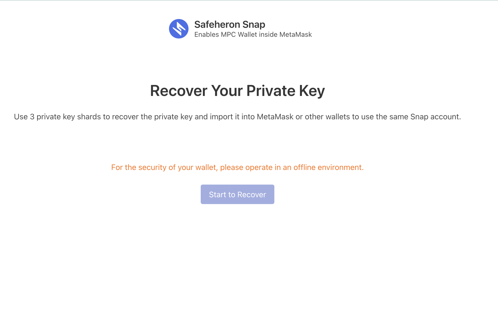
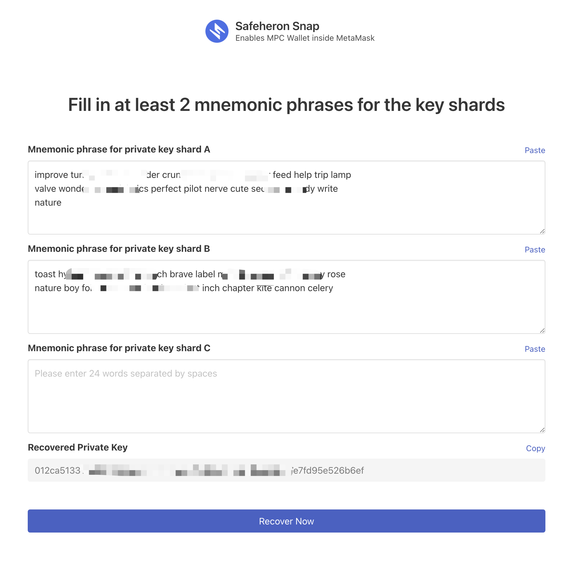

# Safeheron Snap's Offline Private Key Recovery Tool

---

The offline private key recovery tool for Safeheron Snap is a simple and efficient way to help users of Safeheron Snap to recover their MPC wallets.

Please at least use 2 backup mnemonic phrases to successfully recover the wallet.

## How to Use

 Download the latest `index.html` from [the releases page](https://github.com/Safeheron/snap-offline-recovery-tool/releases) and open it using the browser you prefer. 
 Follow the prompts to disconnect your device from the network (VPN included) and enter the backup mnemonic phrases 
 to restore the original private key.





## Running it Locally

Clone this repository:

`git clone https://github.com/Safeheron/snap-offline-recovery-tool`

`cd snap-offline-recovery-tool`

### Development

```bash
yarn 
yarn run dev
```

### Build
```
yarn
yarn run build
```
